# Развертка сайта на хостинге и посадка на cms систему.

Заходим на на наш хостинг: [Beget](https://beget.com/ru). Авторизируемся (Доступы уточнить у своего руководителя).


Далее переходим в панель управления нашим хостингом и переходим в раздел Домены и поддомены:

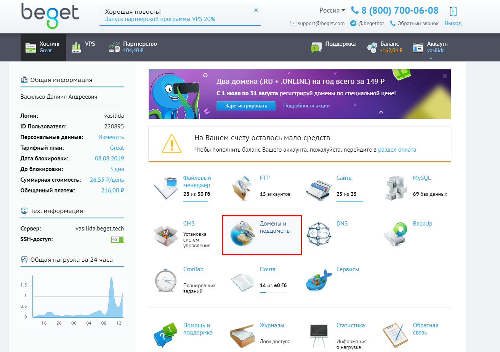

Создаем новый поддомен формата podomen.asap-lp.ru :

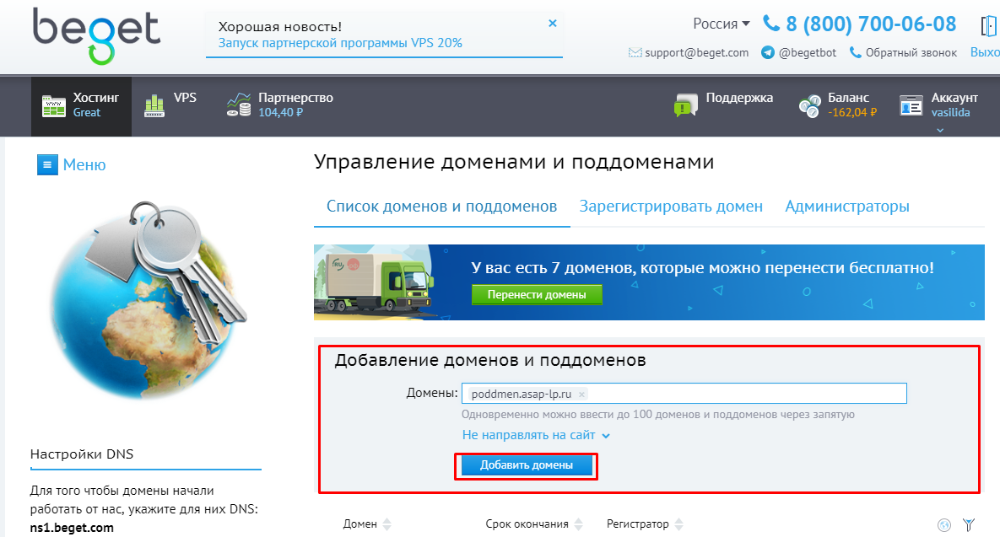

Следующим шагом переходим в раздел сайты:

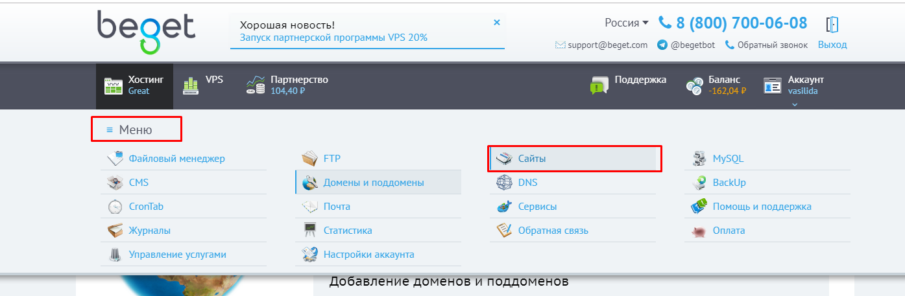

Если количество сайтов закончилось, обращаемся к своему руководителю:

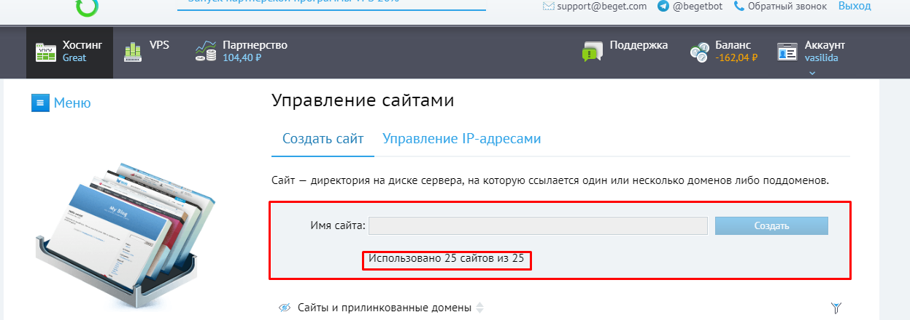

После создаем новый сайт, привязывая к нему ранее созданный домен:

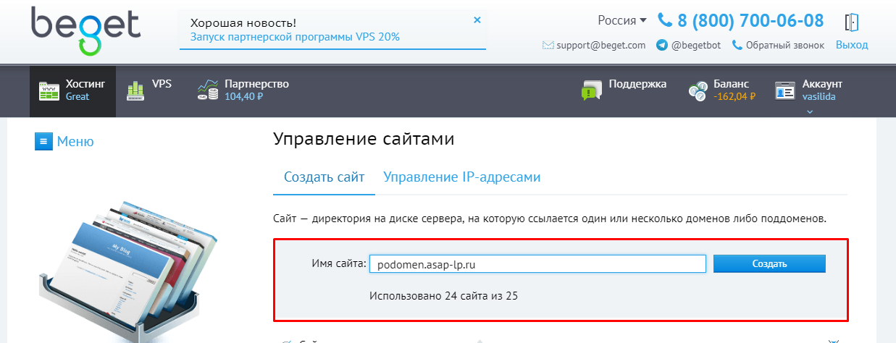

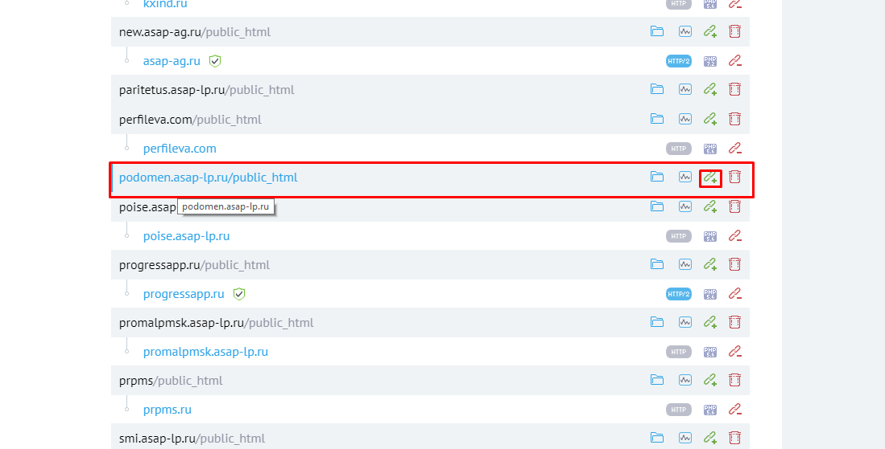


**Внимание!** до работоспособности Сайта может пройти какое-то время, не предпринимаем никаких действий, пока по адресу привязанного домена  не увидим следующую картину:

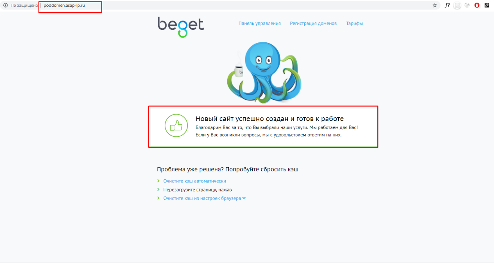

Следом устанавливаем на сайт cms. Переходим в раздел cms:

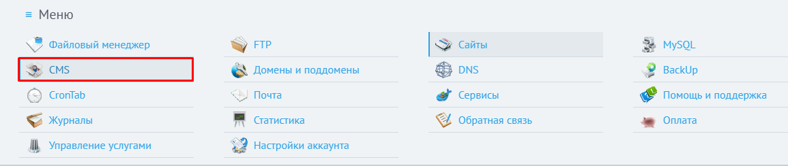

Листаем вниз и выбираем cms:

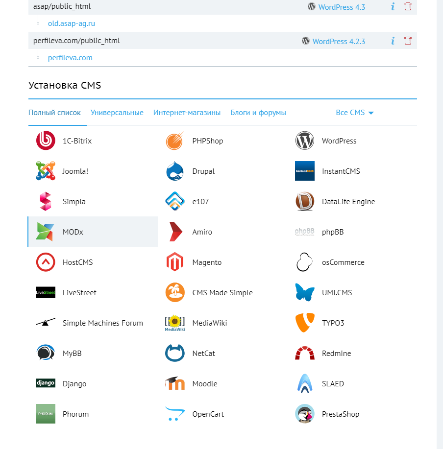

Далее выбираем сайт для установки, логин администратора, пароль администратор, нажимаем "расширенная настройка бд":

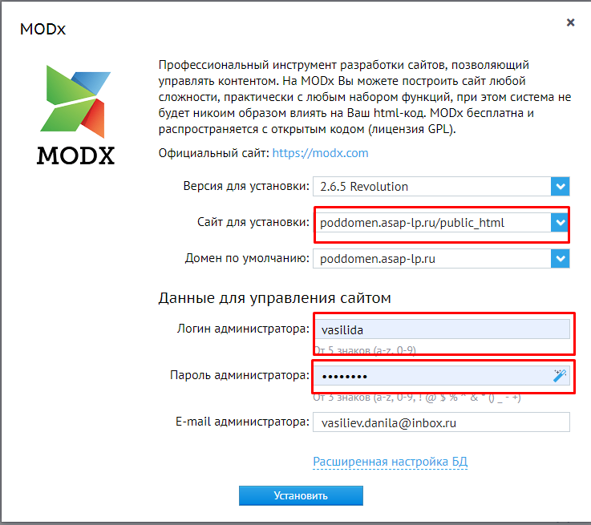

Выбираем имя бд(оно должно начинаться с vasilida_ ) и пароль для бд и нажимаем установить:

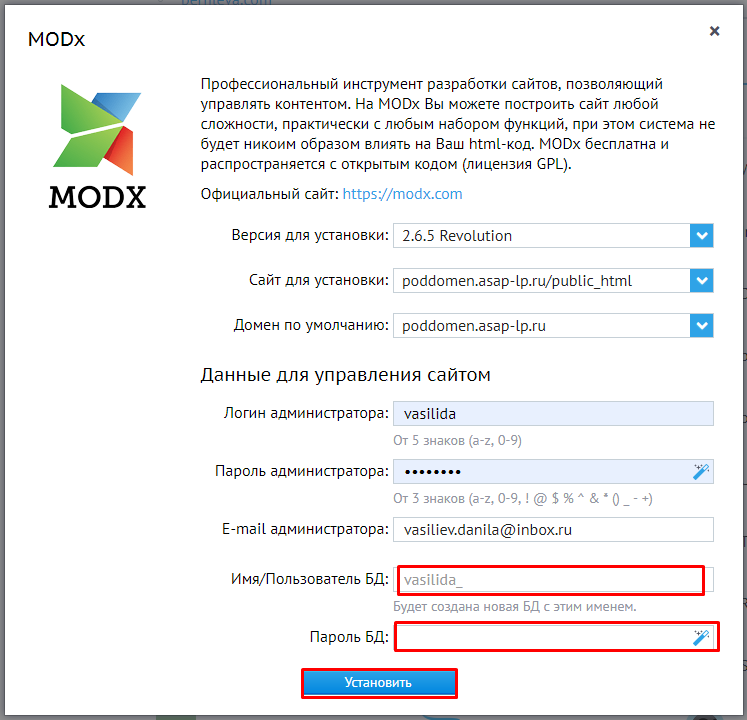

Проверяем успешно ли была установленна cms:

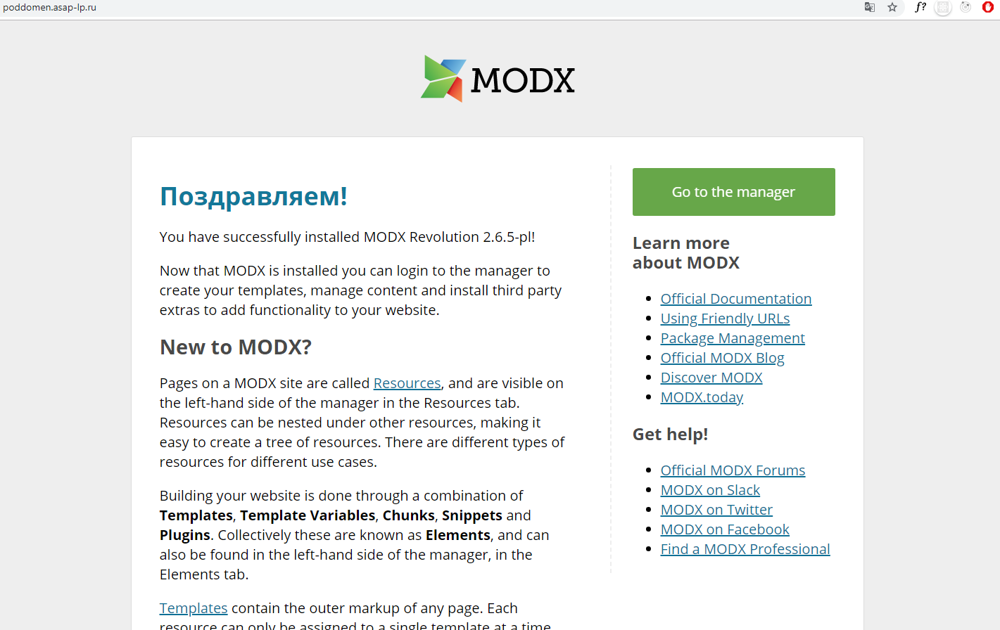

**Внимание!!!Обязательно заносим логин,пароль от админки и логин, пароль от базы данных в файл и размещаем в файловом хранилище организации в папке с проектом с названием "Доступы от сайта.docx"**

Далее необходимо закрыть сайт от индексации поисковиками, путем размещения в корне сайта файла robots.txt следующего содержания (Содержание файла может обновится смотреть в wiki организации, в файлом хранилище):

```
User-agent: *
Disallow: /
User-agent: Yandex
Disallow: /
User-agent: Googlebot
Disallow: /
```

Заходим в файловый менеджер в панели управления:

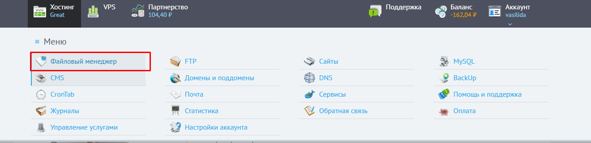

Далее заходим в public_html нашего сайта и размещаем там файл с помощью загрузчика:

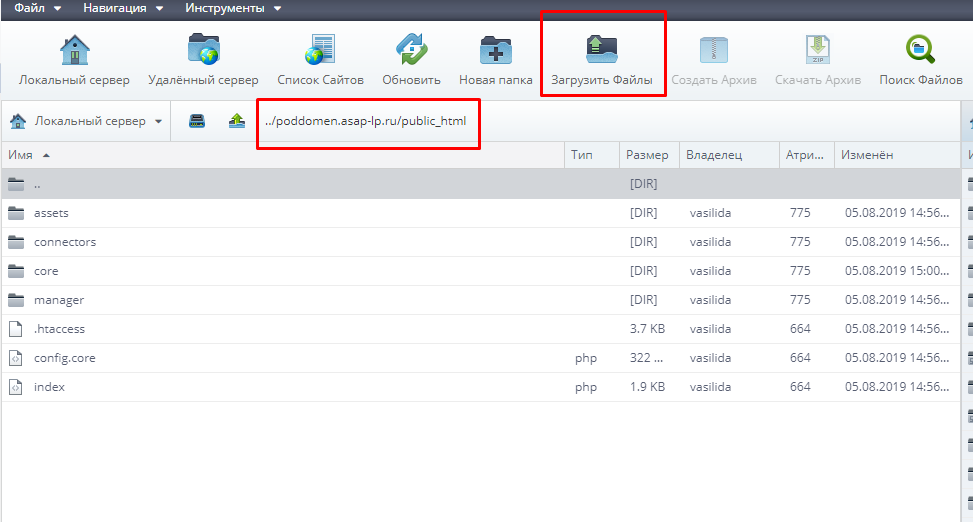

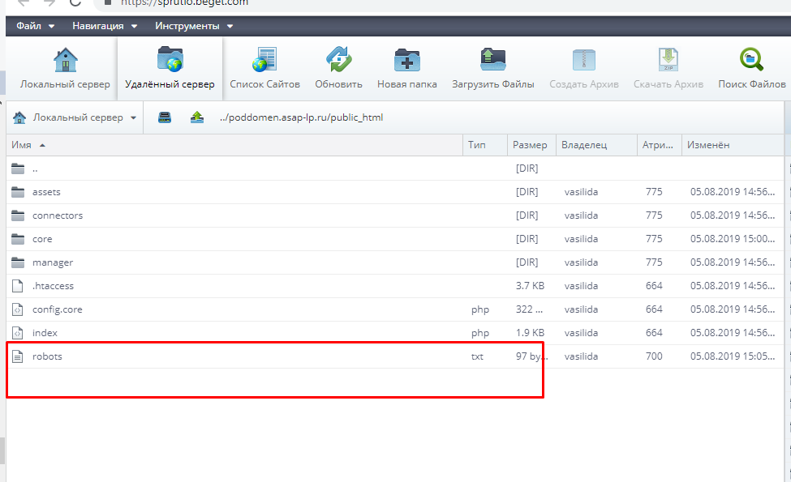

Проверяем файл: Открыть через браузер файл robots.txt (http://адрес_сайта.ru/robots.txt) и проверить его корректность:

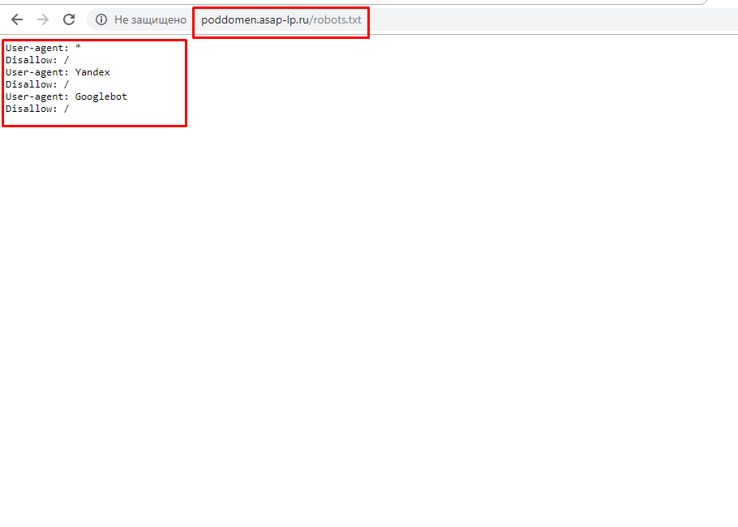


